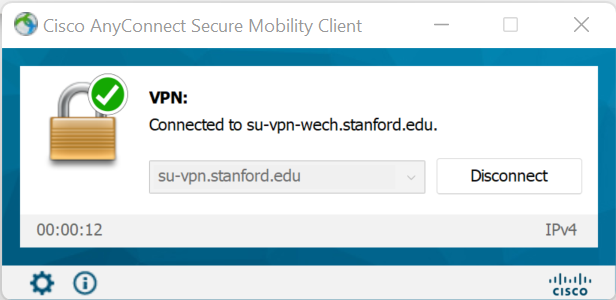

# Computing at Stanford
In this lesson, we're going to talk about how to access the various computing resources at Stanford. Specifically we will talk about:
1. Connecting to Wi-Fi
2. Two-Factor Authentication
3. Stanford Computing Clusters
4. Your website
5. Miscellaneous Resources

## Connecting to Wi-Fi
If you haven't done this already, the first thing you will probably want to do is connect to the Wi-Fi at Stanford.
There are a few different networks on campus with different purposes:
* Stanford Visitor - Open to anyone, short-term sessions and limited bandwidth, accept agreement to connect
* Stanford - General network, requires SUID login 
* Eduroam - For students visiting campus, you can use at other universities; requires an account at an institution that participates in *[eduroam](https://eduroam.org/)*.

We recommend using Stanford. For now, try connecting to Stanford Visitor and you can try connecting to Stanford after class, since that requires some more work (device registration is required). This link will give you information about all of the networks:
https://uit.stanford.edu/service/wirelessnet

You can connect to eduroam using your Stanford credentials or automatically with Cardinal Key (a digital certificate). These links will walk you through required steps for either service:
https://uit.stanford.edu/service/wirelessnet/eduroam
https://uit.stanford.edu/service/cardinalkey
It is nice to have the option to connect to both Stanford and eduroam depending on connection speed sometimes one is a lot better than the other. 

*Note: All wireless devices must first be registered in the Stanford network database (NetDB) before they can connect to networks (not including "Stanford's Visitor" wireless guest network). Even if you have already registered your laptop's wired Ethernet connection, you must also register your wireless connection. Additionally, if you are living in Stanford residences, you can also connect gaming and some smart home devices to the Stanford wifi by registering them as "other" and using their MAC addresses, etc.*

## Two-Factor Authentication
When you log onto many Stanford services, you will need to use two-factor authentication to log in. This website gives the information on how to set everything up: https://uit.stanford.edu/service/authentication/twostep

To summarize, you can put in your phone number to set up the following methods of authentication:
1. Duo Mobile push notification
2. Duo Mobile passcode
3. Phone call
4. SMS text message

While all of these methods work, we strongly recommend getting the Duo Mobile app if you have a smartphone, as the push notifications are the easiest and most consistent because they do not require typing in a code or phone service. You can also get the Duo app on a tablet device, so you can use your phone or tablet as the authenticator. 

## Virtual private network (VPN)
Some Stanford services (for instance, connection to certain computing clusters) require one to be logged into the Stanford network. If you are off campus, you can still use these services by connecting to a VPN. Instructions for installing a VPN client are here: https://uit.stanford.edu/service/vpn.

We recommend using the Cisco AnyConnect client. The download links for Windows and Mac OS are provided on the webpage above. The mobile client is also available for Android and iOS. When you open the VPN client from a desktop, a window will pop up and the next step will ask you for the password and two-factor authentication:

When you get connected successfully, it will look like this:

## Software

Stanford has licenses for several software products. For a full list and to download any software, go to https://uit.stanford.edu/service/softwarelic. 

Some products are free to Stanford students (for instance, [Windows](https://uit.stanford.edu/service/softwarelic/microsoft/itprofessional), [MATLAB](https://uit.stanford.edu/service/softwarelic/matlab), Mathematica), and some are reduced-price (for instance, Adobe Creative Cloud, available at [Software Liscening Webstore](https://stanford.onthehub.com/WebStore/Welcome.aspx)).

## Printing

There are a couple methods for printing from your personal device at Stanford. Check out [Cardinal Print](https://uit.stanford.edu/service/cardinal-print). 

* Cardinal Print gives you the option to print via email/website or by downloading a printer driver. Follow the instructions at the Cardinal Print website.
* The printer in ICME is now operating with Cardinal Print as well. More ICME printing specific information, including printing budget information can be found on the ICME intranet (requires log-in) [here](https://icmeintranet.stanford.edu/students/stanford-campus-resources/printing).

## Cluster Computing
### What is cluster computing?
A computer cluster is a group of computers that can be accessed by a group of users. Such systems are used by universities and companies in order to give access to a limited number of software licenses, more efficiently distribute computing power, and to make it easier to manage the organizations computing resources. In a compute cluster, a group of users can remotely access a group of computers. A cluster consists of **login nodes** and **compute nodes**.

Login nodes are the nodes that invidual users connect to to edit files, compile code, submit jobs to the compute nodes, and do light post-processing. Since only light work is done on login nodes, they are less powerful than compute nodes. When you connect to a cluster, you will be put onto the least used login node to do these things. Since multiple users could be on the same login node at once, you are only allowed to do light work, so that the system is functional for all users.

Compute nodes are more powerful computers used primarily for tasks requiring more power than everyday tasks. To use a compute node, a user submits a **job** to a **scheduler** which then determines how to assign users to compute nodes. Some examples of job schedulers are SLURM and PBS. When requesting a job, you can specify the number of nodes to user, amount of time needed, what specific types of computers to use, and many other options. Since these computers are assigned to individual users and are designed to only be used for computing, there are very few background processes running, allowing the hardware to be used most efficiently. In general, most jobs just run the programs you give them automatically when the scheduler assigns you to a group of nodes, but you can also request interactive jobs as well (for instance if you wish to use an interactive program, such as MATLAB or ParaView).

In addition to all of these uses, some clusters are just used as a convenient way for an organization to allow access to a wide range of software to its users. For example, Stanford has a limited number of MATLAB licenses, so it gives students access to them through a cluster.

### Clusters at Stanford
In this section we will introduce the different computing clusters at Stanford and more depth on Farmshare in particular. This section will use some amount of Unix, which will be covered in greater detail in a later section.
The information about most of the clusters can be found at https://srcc.stanford.edu/services-systems-overview but an overview of the most commonly used clusters:
* Farmshare 2
  * https://srcc.stanford.edu/farmshare2
  * Available to anyone who has a full-service SUNetID
  * Used for coursework, research, and accessing university software
  * 14 login nodes, 5 96 GB compute nodes, 2 787 GB compute nodes, 10 128 GB compute nodes with NVIDIA Tesla K40
  * Access to [AFS](https://uit.stanford.edu/service/afs)
* Sherlock
  * https://www.sherlock.stanford.edu/
  * Main research cluster accessible by all faculty
  * Faculty can obtain use allocations on both shared and private resources
  * Requires faculty sponsorship
  * 1672 compute nodes, 44032 CPU cores, 712 GPUs
* ICME GPU Cluster
  * https://icme.stanford.edu/get-involved/resources/hpc-resources
  * Accessible to anyone at Stanford by request
  * Usable for researtch requiring GPUs
  * 32 nodes (20 CPU nodes and 12 GPU nodes) 
* HPCC Clusters
  * https://hpcc.stanford.edu/
  * School of Engineering access by faculty request
  * Used for research and specific courses
  * CPU, GPU, and KNL Clusters
* Other Clusters
  * XStream GPU Cluster
  * Stanford Genomics Clusters
  * Population Health Sciences
  * And more...

### Farmshare
Farmshare is a cluster open to everyone at Stanford that can be used for pretty much anything from coursework to research. Additionally, it can be used to access Stanford software. Within Farmshare, there are three server types:
* *rice* - Login nodes for running smaller programs, accessing files, and submitting jobs.
* *wheat* - Compute nodes with more CPU power and memory.
* *oats* - GPU compute nodes.

### Connecting to Farmshare via SSH
To connect to any of Stanford's clusters we will use a **secure shell** (SSH). This will connect you to a Linux terminal on the cluster from which you can work. If you wish to use interactive programs with a GUI (such as MATLAB), then you will need to enable X11 forwarding when you SSH. This process is slightly different for each operating system:
* Linux
  * Open a terminal
  * `ssh sunetid@rice.stanford.edu` - To SSH onto Farmshare
  * `ssh -X sunetid@rice.stanford.edu` - To SSH onto Farmshare with X11 forwarding
* Mac
  * Open a terminal
  * `ssh sunetid@rice.stanford.edu` - To SSH onto Farmshare
  * Install XQuartz and use `ssh -X sunetid@rice.stanford.edu` - To SSH onto Farmshare with X11 forwarding
* Windows
  * Install PuTTY (or MobaXterm or SecureCRT)
  * Follow instructions in software to connect (It will require inputting a username and the name of the server)
  * Install XMing or MobaXterm and connect with the X11 option in the Windows X11 Client
  * Alternatively, Windows users can also uses the Linux subsystem for most Linux things. https://www.howtogeek.com/249966/how-to-install-and-use-the-linux-bash-shell-on-windows-10/

Disconnect: `exit`

Here is a link to more information about connecting to Farmshare: https://srcc.stanford.edu/farmshare2/connecting

For next class, you will be asked to connect to Farmshare from your own computer with X11 forwarding, so we can follow some Linux tutorials. Note that CME 211 will require you to run programs on Farmshare, so this information will be included at the beginning of that class as well. 

### Farmshare software
Farmshare is how the university distributes access to a variety of software. The list of software can be found at https://srcc.stanford.edu/farmshare2/software or by using the `module avail` command in the terminal. Some of the highlights include:
* Anaconda
* ANSYS
* cmake
* CUDA
* emacs, vim, nano
* GNU and Intel Compilers
* Julia
* Mathematica
* MATLAB
* OpenFOAM
* R
* Stata
* Torch

You can list available software using `module avail` (or short version `ml av`).

To access any of these programs, use `module load [name of module]` (or short version `ml [name of module]`) to load the module, and then use the name of the command to run the program. Access to many of these programs is also available on the computers in the libraries around campus, like the Turman Engineering Library in Huang.

### AFS
AFS stands for Andrew File System. It is an internal file system at Stanford that you can use to store files, and is accessible from Farmshare and in the libraries on campus. AFS files are accessible via the Web or through file transfer programs such as OpenAFS or Fetch (Macintosh) and SecureFX (Windows). For general file storing, I would use Box or Drive, but this is one way to pass files to and from Farmshare without using any outside software. It is accessible at https://afs.stanford.edu/.

### Sherlock OnDemand
Sherlock OnDemand is an interface for access to Sherlock resources via a web browser
* https://login.sherlock.stanford.edu/pun/sys/dashboard
* upload and download files
* create, edit, submit, and monitor jobs
* run applications: Jupyter Notebook, RStudio, TensorBoard
* connect via SSH

## Your Website

For publishing a personal website, Stanford offers multiple options. See a comparison here: https://uit.stanford.edu/guide/website/personal
* [Stanford Domains](https://uit.stanford.edu/service/sudomains) 
* [Stanford Sites](https://uit.stanford.edu/service/stanfordsites) 
* [AFS Web Hosting](https://uit.stanford.edu/service/web/centralhosting/howto_user): Stanford gives everyone a domain for your own website. It is accessible at http://web.stanford.edu/~yoursunetid/. This website can be updated by putting html files into the WWW directory in your AFS directory. `index.html` will serve as your homepage.
* [Google Sites](https://uit.stanford.edu/service/gsuite/sites)
* Self-help Web Design Resources: https://uit.stanford.edu/service/web/design

## Miscellaneous Resources
* Stanford library catalogue: http://library.stanford.edu/
* Accessing library resources off campus: http://library.stanford.edu/using/connecting-e-resources
* Stanford Software Licensing: https://uit.stanford.edu/service/softwarelic
* Stanford Box: https://uit.stanford.edu/service/box
* Stanford Slack: https://uit.stanford.edu/service/slack
* Stanford Google Drive: https://uit.stanford.edu/service/gsuite/drive
* Stanford Email: http://webmail.stanford.edu
* Stanford course evaluations: https://carta-beta.stanford.edu/
* Stanford VPN: https://uit.stanford.edu/service/vpn
* Stanford Mailing Lists: https://uit.stanford.edu/service/mailinglists/tools
* Stanford directory: https://stanford.rimeto.io/
* Stanford course information: https://explorecourses.stanford.edu/
* IT Help: https://uit.stanford.edu/service/help and https://stanford.service-now.com/it_services?id=portal_home
* Stanford Bookstore Tech Center: http://web.stanford.edu/group/bookstore/service.html
* C2 (Computational Consulting): https://icme.stanford.edu/get-involved/resources/computational-consulting-c2
